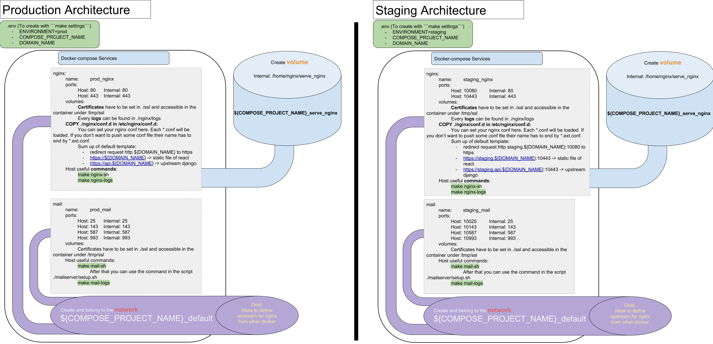

# Setup

## Adapt for your projet
Search for these terms and adapt the code with what you want: (case insensitive and don't forget to look at filename)
- YOUR_PROJECT 
- YOUR_DOMAIN
- YOUR_IP
- YOUR_HOSTNAME
- YOUR_PASSWORD_SALT
- YOUR_SSL_PORT


## Guideline first install
1. Finish this document
2. Read this [one](CONTRIBUTING.md)
3. Create a ssl directory at the root with:
    - YOUR_DOMAIN_ssl_certificate.cer  
    - YOUR_DOMAIN_private_key.key   
4. Then run 
```bash
make settings
vim .env
```
5. Fill this file with your settings.
6. Run ```make```
7. Then create a new account with the command ```./mailserver/setup.sh email add <email> [<password>]```
8. Run ```./mailserver/setup.sh config dkim``` Now the keys are generated, you can configure your DNS server by just \
pasting the content of config/opendkim/keys/domain.tld/mail.txt in your domain.tld.hosts zone.
9. Finally run
```bash
docker-compose down
make
```
10. Now you can rebuild this architecture with ```make``` whenever you want. See [Makefile](Makefile) for more commands.


## MailServer
[Doc](mailserver/README.md)

## Nginx
If you want Nginx to serve some static file. 
Connect your docker to the volume: serve_nginx, and link your static repository in this volume. 
Now in your nginx conf file, you should be able to find them in the /home/nginx/serve_nginx/YOUR_REPO.


## Architecture

